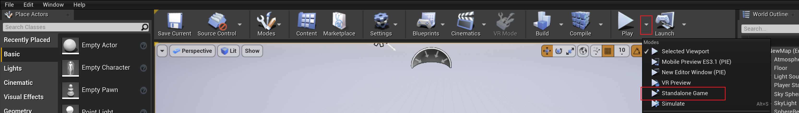
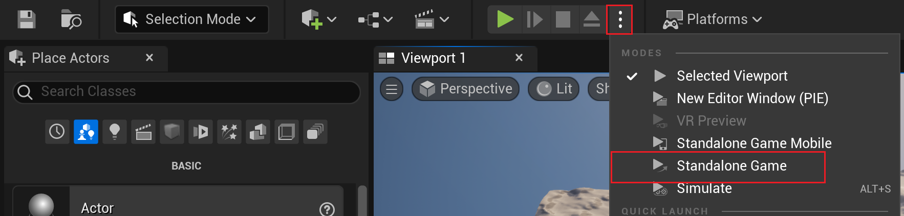
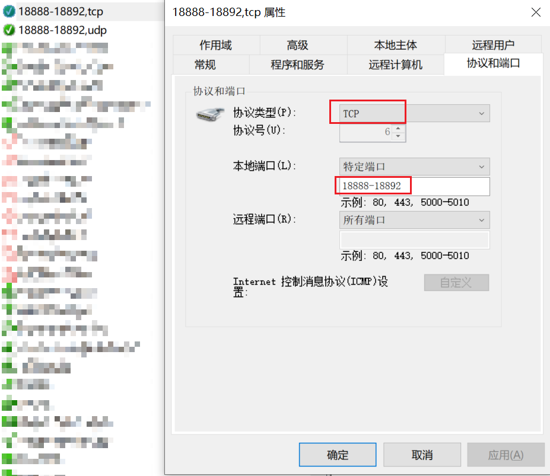
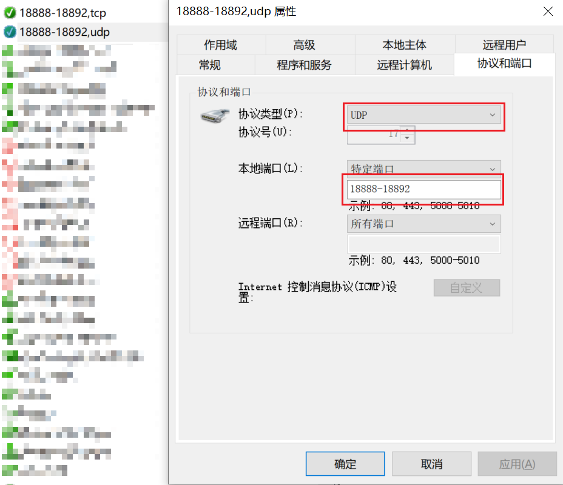
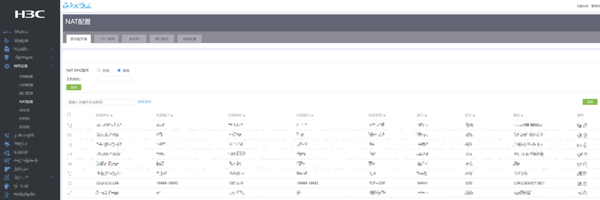
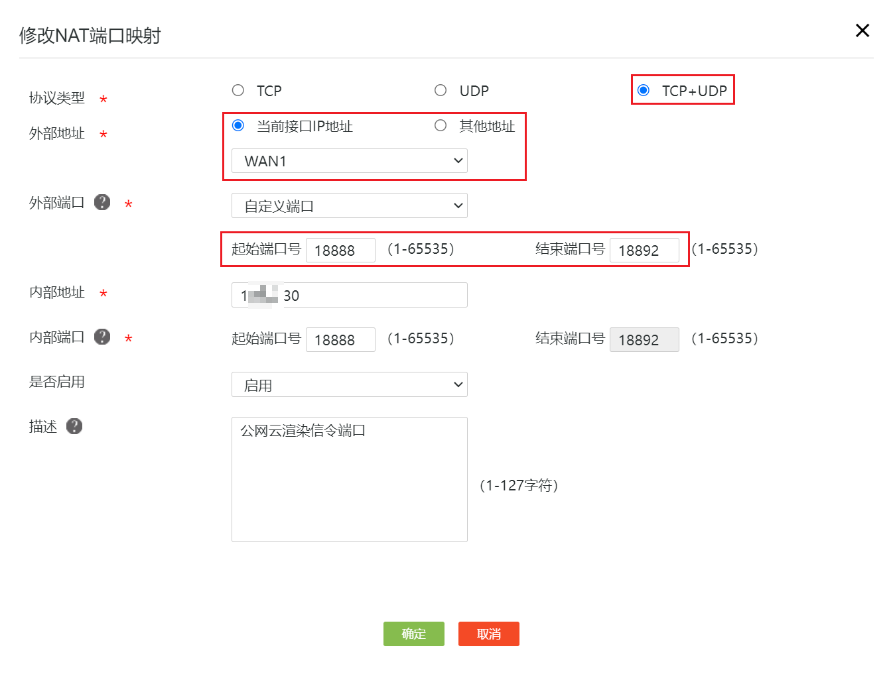

# 概述

OpenZICloudRender是一款云渲染（像素流）插件，其和官方原生的像素流插件（PixelStreaming）有所不同。该插件在相同流送配置下的云渲染过程中所占用的网络带宽仅占官方原生的云渲染的55%左右。并且其所采用的云渲染方式为独立子进程的方式进行渲染，如果云渲染模块异常退出或者崩溃不会导致整个UE程序的退出，插件中自带的守护进程会在极短的时间内重启云渲染程序，重新建立流送通信。

目前的OpenZICloudRender支持的平台有：

- [x] Windows
- [x] Linux
- [ ] Mac

支持的显卡有：

- [x] NVIDIA卡
- [ ] AMD卡 

支持的RHI有：

- [x] D3D11
- [x] D3D12
- [x] Vulkan
- [ ] OpenGL

支持的编码格式有：

- [x] H264
- [ ] H265

支持传输的内容有：

- [x] 视频帧
- [x] 音频帧

# 目录结构及说明

## 插件目录结构

```c++
├─Config
│      OpenZICloudRender.json // 云渲染配置文件
├─Programs
│  ├─CloudRenderServer // 云渲染程序包
│  │   ├─OpenZICloudRenderServer.json // 云渲染程序配置文件
│  └─SignallingWebServerCustom // 网页及信令服务包
│      ├─node_modules // Node服务依赖的模块包
│      ├─platform_scripts // 和官方类似
│      ├─scripts // webrtc通信脚本
│      └─player.html // 云渲染网页
└─Source
    ├─OpenZICloudRender // 云渲染模块代码
    └─OpenZICloudRenderInstaller // 编译时拷贝资源模块
```

## 插件编译后工程目录结构

```c++
├─Binaries
├─Build
├─Config
│  ├─OpenZICloudRender.json // 编译后自动拷贝过来的云渲染配置文件
│  ├─OpenZICloudRenderServer.json // 编译后自动拷贝过来的云渲染程序配置文件
├─Content
├─Intermediate
├─Plugins
├─Programs // 编译后自动拷贝过来的程序包
├─Source
└─YourProjectName.uproject
```

## 工程打包后的目录结构

以Windows平台的包为例（Linux类似）

```c++
├─Engine
├─YourProjectName
│   ├─Binaries
│   ├─Config
│   │  ├─OpenZICloudRender.json // 打包后自动拷贝过来的云渲染配置文件
│   │  ├─OpenZICloudRenderServer.json // 打包后自动拷贝过来的云渲染程序配置文件
│   ├─Content
│   └─Programs // 打包后自动拷贝过来的程序包
├─Manifest_DebugFiles_Win64.txt
├─Manifest_NonUFSFiles_Win64.txt
├─Manifest_UFSFiles_Win64.txt
└─YourProjectName.exe
```

# 快速开始

## 环境部署

因为云渲染流程中使用到了Node服务，因此需要确保您的电脑中在全局范围内安装了`Node.js`，软件版本没有硬性要求，可以从[Node.js官网](https://nodejs.org/)下载稳定版或最新版。

打开`Config/OpenZICloudRender.json`文件，修改其中的参数`bEnableCloudRender`为`true`，即：

```json
{
    "bEnableCloudRender": true, // 将此属性修改为true
    "bShowMouse": true,
    ...
}
```

**注意修改json文件时要使用英文标点符号，如果该配置项不是最后一项配置，一定要有英文的逗号，不然json文件格式有误，会导致读取配置项失败，从而程序流程走的都是默认配置**

如果配置文件中的各个端口号并没有被占用的情况，可以不修改。

如果您是在UE编辑器下进行云渲染，则使用`独立进程游戏`的方式运行UE程序，如果您使用的是`选中的视口`或者`新建编辑器窗口（PIE）`，则云渲染是不会启动的，这个和UE官方的像素流插件是保持一致的。

UE4启动方式如下图：



UE5启动方式如下图：



如果您是打包后进行云渲染，则无需额外配置。

## 注意事项

### OpenZICloudRender插件和PixelStreaming插件

如果您正在同时使用UE官方的像素流插件，即您已了解UE官方的像素流插件的开启方式是通过启动参数`-PixelStreamingUrl`或者`-PixelStreamingIP`加`-PixelStreamingPort`来进行云渲染的。那么在启用OpenZICloudRender云渲染时，需要将UE的像素流关闭，不然如果端口也使用的是相同的，会导致异常情况发生，您可能无法在网页中查看到正常的云渲染画面。

但是OpenZICloudRender插件和官方的PixelStreaming插件是可以共存的，即插件可以都被启用，可以都被打进程序包中，只是在启动时需要注意不要同时开启两个插件的云渲染。如果您想快速停用UE官方的云渲染，则只需将上述的`-PixelStreaming...`启动参数加个前缀或者后缀，使得代码中无法正确识别启动参数从而不启用官方的云渲染插件，如修改为`-1PixelStreamingUrl`即可。

# 配置参数说明

插件的配置文件有两个，分别是`OpenZICloudRender.json`和`OpenZICloudRenderServer.json`。

- `OpenZICloudRender.json`控制云渲染模块启动时的IP和端口等相关配置
- `OpenZICloudRenderServer.json`控制独立云渲染程序启动时的编码和推流部分等相关配置

## OpenZICloudRender.json配置说明

```json
{
    "bEnableCloudRender": true, // 是否开启云渲染
    "bShowMouse": true, // OpenZI兼容产品可用
    "bWebsocketServerMode": false, // OpenZI兼容产品可用
    "bUseOpenZICloudRenderProduct": true, // OpenZI兼容产品可用，此项只能为true否则云渲染不会启用
    "CloudMode": "OpenZI", // OpenZI兼容产品可用，此项只能为OpenZI否则云渲染不会启用
    "bUseApiWebServer": false, // OpenZI兼容产品可用，用于控制是否启动OpenZI产品的API服务器
    "ApiWebServerPort": 18892, // OpenZI兼容产品可用，用于控制OpenZI产品的API服务器监听端口
    "bCloudPublicAccess": false, // 是否开启公网云渲染
    "bLaunchTurnServer": false, // 是否由插件管理启动公网云渲染所需的中继服务器，如果您开启了公网云渲染，又手动启动了中继服务器，该项可以填false
    "bLaunchSignallingWebServer": true, // 是否由插件管理启动云渲染所需的信令服务器。如果您手动启动了信令服务器，该项可以填false
    "CloudStunServer": "127.0.0.1:18890", // 公网云渲染时使用的Stun服务器地址
    "CloudTurnServer": "127.0.0.1:18891", // 公网云渲染时使用的中继服务器的地址。如果由插件管理启动中继服务器，则插件会根据该项配置设置中继服务器的监听端口及公网IP
    "CloudPublibIP": "127.0.0.1", // 公网云渲染时分配的IP，该IP需要在路由器中进行端口映射，且本机需要打开该端口的访问权限
    "CloudLocalIP": "127.0.0.1", // 公网云渲染时的内网IP，由中继服务器获取进行转发服务索引
    "WebConfig": {
        "PublicIp": "127.0.0.1", // 网页端使用到的公网IP，如果开启公网云渲染则此项填写相同的公网IP
        "HttpPort": 18888, // 网页服务监听的端口号，即用户在浏览器中访问网页时需要填写的端口号
        "StreamerPort": 18889, // 信令服务器监听的端口号，即云渲染打通点对点连接时需要用到的端口号
        "ApiURL": "ws://127.0.0.1" // OpenZI兼容产品可用，用于控制OpenZI产品网页连接的API服务器IP
    },
    "FrameBufferSizeX": 2560, // 云渲染初始化时的程序分辨率X分量，最大值为3840
    "FrameBufferSizeY": 1440, // 云渲染初始化时的程序分辨率Y分量，最大值为2160，详细说明看下文
    "MaxCache": 60 // 云渲染画面帧缓存数
}
```

### 关于云渲染初始化时的程序分辨率

云渲染开启后，程序运行过程中的渲染实际分辨率是不会变化的，变化的只是显示分辨率。举个例子，如果您初始化时给定的分辨率是`1920x1080`，在运行中您的网页的分辨率是`3840x2160`，而网页中默认设置的是全屏铺满等比缩放，因此底层的运算中，会拿渲染实际分辨率`1920x1080`的像素，均匀的放在`3840x2160`的画布上。即渲染出来的1个像素要被放在4个格子里，白话讲就是在`3840x2160`的浏览器网页中画面看着会糊。因为程序并不会自动进行超采样计算，这个不属于云渲染功能模块的侧重点。

如果您初始化分辨率给的是`3840x2160`，但是网页窗口的实际分辨率只有`1920x1080`，即渲染的4个像素要填充显示的1个像素，这个时候因为源数据量大于目标数据量，因此程序是可以进行合理的降采样计算的，白话讲就是画面看着不会模糊，甚至会有一些锐化效果，但是如果锐化效果带来的噪点使得您的画面看上去效果也不佳，则您需要注意这一点，对云渲染初始化分辨率进行合理的配置。

### 关于OpenZI兼容产品可用

目前提供的云渲染插件是更加通用的，任何一个满足条件（即UE版本、操作系统）的UE工程都可以集成进行云渲染。配置项中有一部分是OpenZI兼容产品可用，指的是兼容OpenZI的其他产品如API、编辑器等。其他OpenZI产品也是可以集成云渲染插件的，但是流程和通用的流程稍有不同，其中做了更多的性能优化及自定义适配，以使得OpenZI其他产品的云渲染更节省资源。在您使用的过程中，这些配置项是不需要关注的，如果您对OpenZI的其他产品及兼容版本的云渲染感兴趣，可以从[OpenZI官网](http://www.cengzi.com/)或OpenZI开源社区了解更多。我们提供了集成化的案例以及操作手册可供预览和体验。

## OpenZICloudRenderServer.json配置说明

```json
{
    "DebugDumpFrame": false, // 将帧从编码器转储到磁盘上的文件，以便进行调试。
    "DegradationPreference": "MAINTAIN_FRAMERATE", // 降级偏好是WebRTC的策略，即在更改编码器比特率/QP不足时，破坏性地调整比特率（更改分辨率/丢帧）。
    "EnableFillerData": false, // 通过填充垃圾数据来维持恒定的比特率。注意：CBR和MinQP = -1时不需要。
    "EncoderCodec": "H264", // 目前仅支持H264编码器
    "EncoderGopLength": 300000000000000,
    "EncoderKeyframeInterval": 1, // 插帧间隔，不建议修改
    "EncoderMaxBitrate": 20000000, // 最大比特率（bps）。在带有NVENC的CBR速率控制模式下不起作用。
    "EncoderMaxQP": 51, // 0-51，值越低，质量越高，但比特率越高。注意：-1将禁用对最大QP的所有硬限制。
    "EncoderMinQP": 0, // 0-51，值越低，质量越高，但比特率越高。注意：-1将禁用对最小QP的所有硬性限制。
    "EncoderMultipass": "FULL", // 编码器每帧要传递多少次。更多细节，请参阅NVENC文档。支持的模式有 "DISABLED"、"QUARTER"、"FULL"
    "EncoderRateControl": "CBR", // 视频编码器RateControl模式。支持的模式有"CONSTQP"、"VBR"、"CBR"。注意：CBR是我们唯一推荐的模式。
    "EncoderTargetBitrate": -1, // 目标比特率（bps）。设置此项会忽略WebRTC想要的比特率（不推荐）。设置为-1时禁用。
    "EncoderTuningInfo": "ULTRA_LOW_LATENCY", // 可填写ULTRA_LOW_LATENCY、LOW_LATENCY、HIGH
    "H264Profile": "AUTO", // 编码器使用的H264配置文件。支持的模式有 "AUTO" 、 "BASELINE" 、 "MAIN" 、 "HIGH" 基线（Baseline）是唯一保证能受到支持的配置文件，前提是接收方的设备支持WebRTC。
    "RHIName": "D3D12", // 支持的RHI目前有"D3D11"、"D3D12"和"Vulkan"。Linux下仅能使用Vulkan。UE4建议使用D3D11，UE5建议使用D3D12
    "SendPlayerIdAsInteger": true,
    "SignallingServerUrl": "http://127.0.0.1:18889/ws", // 该配置项和云渲染部署服务配置中的WebConfig.StreamPort的端口要保持一致
    "StreamerId": "MLCRS",
    "WebRTCDisableAudioSync": true, // 在WebRTC中禁用音频和视频轨道的同步。如果不需要同步，这会改善延迟。
    "WebRTCDisableReceiveAudio": true, // 禁用从浏览器接收音频到UE。
    "WebRTCDisableStats": true,
    "WebRTCDisableTransmitAudio": true, // 禁止将UE音频传输到浏览器。
    "WebRTCFps": 60, // 最大FPS WebRTC将尝试捕获/编码/传输。最大值为60
    "WebRTCHighQpThreshold": 37, // 仅当EncoderMaxQP=-1时使用。值在1至51之间。如果WebRTC的帧数高于此QP，它将尝试做出适配决定。
    "WebRTCLowQpThreshold": 25, // 仅在 EncoderMinQP=-1 时使用。1到51之间的值。如果WebRTC的帧数低于此QP，它将尝试做出适配决定。
    "WebRTCMaxBitrate": 100000000, // 最大比特率（bps），WebRTC的请求不会超出该值。注意，不要将此值设置得太高，因为本地（理想）网络实际上会尝试达到此值。
    "WebRTCMinBitrate": 100000, // 最小比特率（bps），WebRTC的请求不会低于该值。注意不要将此值设置得太高，否则WebRTC会丢帧。
    "WebRTCStartBitrate": 1000000, // WebRTC将尝试开始流送的起始比特率（bps）。值必须介于最小和最大比特率之间。
    "WebRTCUseLegacyAudioDevice": false,
    "bEnableDynamicFps": false, // 若设为true，则当UE程序帧率低于WebRTCFps时，会以当前UE程序帧率覆盖WebRTCFps的值
    "bEncoderUseLowPreset": false // 若设为true，则使用P3编码器预设，否则使用P4编码器预设
}
```

# 网络设置

## 防火墙端口配置

如果云渲染是在内网环境中或者公网环境中（即不是仅在本机访问）运行时，可能需要在防火墙设置中，新建入站规则，防止进行云渲染相关网络连接时，出现无法连接的情况。其主要是针对云渲染中使用到的所有端口，进行授权。防火墙配置端口步骤可参考文章[文章链接](https://blog.csdn.net/leoriclee/article/details/107709697)。请注意，是在运行UE程序的电脑上（即服务器端）进行端口配置，客户端无需进行相关配置。对所有云渲染用到的端口号，设置TCP规则和UDP规则。例如：





## 公网映射

公网映射配置要分情况具体配置。因为每个网络环境使用的网络管理器不尽相同，因此配置流程也存在差异，但原理是一致的。都是为公网IP和内网IP建立一种映射关系，使得其他网段中的客户端通过访问指定的公网IP可以获取到实际运行在内网环境中的服务器上运行的内容。这里附上配置例子示意图：





其中需要配置和防火墙端口配置类似，开放必要的端口，协议支持TCP和UDP，外部地址即想要配置的公网IP地址，内部地址即服务器的内网IP地址。