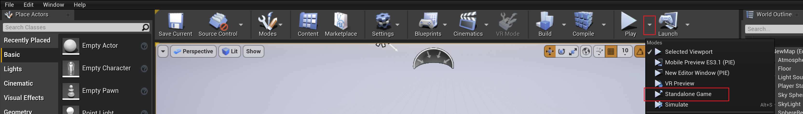
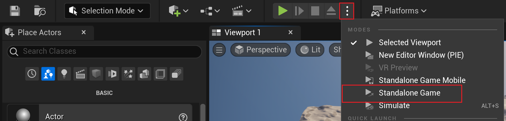
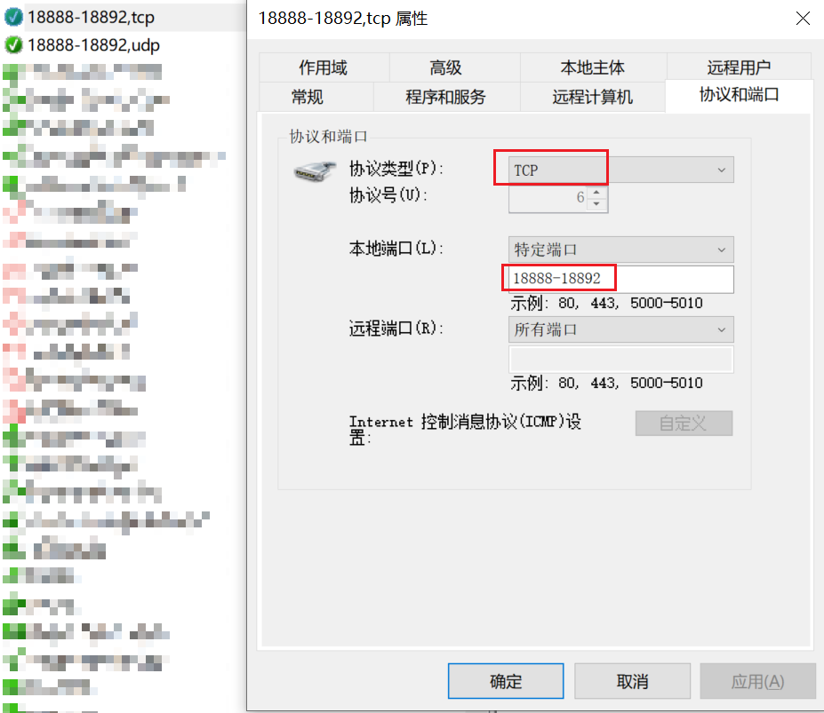
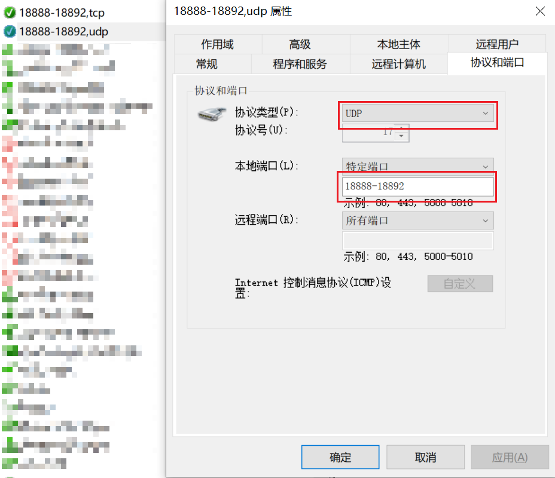
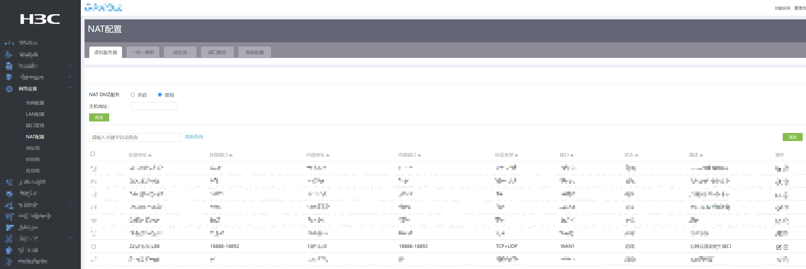
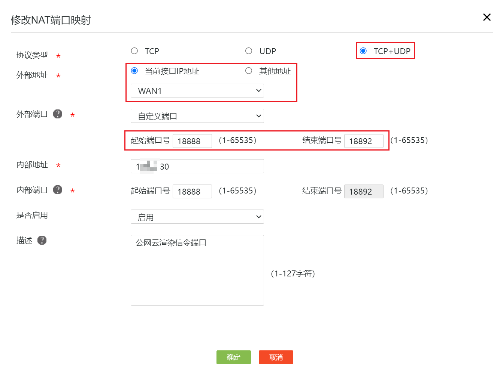

# Overview

The `OpenZICloudRender` is a cloud rendering (pixel streaming) plugin, which is different from the official native `PixelStreaming` plugin. The network bandwidth occupied by the plug-in in the cloud rendering process under the same streaming configuration is only about 55% of the official native cloud rendering. If the cloud rendering module exits abnormally or crashes without causing the entire UE program to exit, the daemon in the plug-in will restart the cloud rendering program in a very short time and re-establish streaming communication.

The platforms currently supported are:

- [x] Windows
- [x] Linux
- [ ] Mac

The graphics cards currently supported are:

- [x] NVIDIA
- [ ] AMD

The RHI currently supported are:

- [x] D3D11
- [x] D3D12
- [x] Vulkan
- [ ] OpenGL

The encoders currently supported are:

- [x] H264
- [ ] H265

The transfers currently supported are：

- [x] Video frame
- [x] Audio frame

# Directory structure

## Plugin directory structure

```c++
├─Config
│      OpenZICloudRender.json // CloudRender config file
├─Programs
│  ├─CloudRenderServer // CloudRender server
│  │   ├─OpenZICloudRenderServer.json // CloudRenderServer config file
│  └─SignallingWebServerCustom // Signalling server and webpage server
│      ├─node_modules // Node modules
│      ├─platform_scripts // Same as native PixelStreaming plugin
│      ├─scripts // webrtc communicate scripts
│      └─player.html // webpage
└─Source
    ├─OpenZICloudRender // CloudRender module code
    └─OpenZICloudRenderInstaller // Copy assets after compiling
```

## Plugin compiled project directory structure

```c++
├─Binaries
├─Build
├─Config
│  ├─OpenZICloudRender.json // Automatically copied cloud rendering configuration file after compilation
│  ├─OpenZICloudRenderServer.json // Automatically copied cloud rendering program configuration file after compilation
├─Content
├─Intermediate
├─Plugins
├─Programs // Packages that are automatically copied after compilation
├─Source
└─YourProjectName.uproject
```

## The directory structure of the packaged project

Take Windows packages as an example (Linux is similar)

```c++
├─Engine
├─YourProjectName
│   ├─Binaries
│   ├─Config
│   │  ├─OpenZICloudRender.json // Automatically copied cloud rendering configuration file after packaging
│   │  ├─OpenZICloudRenderServer.json // Automatically copied cloud rendering program configuration file after packaging
│   ├─Content
│   └─Programs // Packages that are automatically copied after packaging
├─Manifest_DebugFiles_Win64.txt
├─Manifest_NonUFSFiles_Win64.txt
├─Manifest_UFSFiles_Win64.txt
└─YourProjectName.exe
```

# Quick Start

## Environment deployment

Since the cloud rendering process uses Node services, make sure you have `Node.js` installed globally on your machine. There is no hard and fast version, you can download the stable or latest version from the [Node.js website](https://nodejs.org/).

Open`Config/OpenZICloudRender.json`file，modify the param`bEnableCloudRender`to`true`，as follow：

```json
{
    "bEnableCloudRender": true, // set this param to true
    "bShowMouse": true,
    ...
}
```

**Note that you should use English punctuation when modifying the json file.If the configuration item is not the last one, you must include the English comma, otherwise the json file is in the wrong format and the configuration item will fail to read, so the program flow will follow the default configuration**

If the individual port numbers in the configuration file are not already in use, they may not be changed.

If you're using cloud rendering in the UE editor, run the UE application as a `Standalone Game`. If you're using `Selected Viewport` or `New Editor Window (PIE)`, cloud rendering won't start. This is consistent with the UE Pixel Stream plugin.

UE4 starts as shown below:



UE5 starts as shown below:



If you are doing cloud rendering after packaging, no additional configuration is required.

## Notes

### About OpenZICloudRender plugin and PixelStreaming plugin

If you are also using UE's PixelStreaming plugin, you already know that UE's PixslStreaming plugin is enabled via the launch parameter `-PixelStreamingUrl` or `-PixelStreamingIP` and  `-PixelStreamingPort` for cloud rendering. Then, when enabling OpenZICloudRender cloud rendering, you need to turn off the pixel stream of UE. Otherwise, if the port is the same, an abnormal situation will occur, and you may not be able to view the normal cloud rendering picture in the web page.

However, the OpenZICloudRender plugin and the official PixelStreaming plugin can coexist, i.e. both plugins can be enabled, and both can be included in the package. Just be careful not to enable cloud rendering with both plugins at the same time. If you want to quickly disable UE's official cloud rendering, just add the `-PixelStreaming...` The launch parameter will be prefixed or postfixed so that the launch parameter is not correctly recognized in the code and the official cloud rendering plugin will not be enabled, such as `-1PixelStreamingUrl`.

# Description of Configuration Parameters

There are two configuration files for the plug-in, which are`OpenZICloudRender.json` and `OpenZICloudRenderServer.json`.

- `OpenZICloudRender.json`Control the IP and port related configuration when the cloud rendering module is started
- `OpenZICloudRenderServer.json`Control the relevant configuration such as encoding and pushing flow part when the independent cloud rendering program is started

## Description of OpenZICloudRender.json

```json
{
    "bEnableCloudRender": true, // Whether cloud rendering is enabled
    "bShowMouse": true, // OpenZI compatible products available
    "bWebsocketServerMode": false, // OpenZI compatible products available
    "bUseOpenZICloudRenderProduct": true, // OpenZI compatible products available，This must be true otherwise cloud rendering will not be enabled
    "CloudMode": "OpenZI", // OpenZI compatible products available，This must be "OpenZI" otherwise cloud rendering will not be enabled
    "bUseApiWebServer": false, // OpenZI compatible products available，An API server that controls whether or not an OpenZI product is started
    "ApiWebServerPort": 18892, // OpenZI compatible products available，Used to control the listening port of the API server for the OpenZI product
    "bCloudPublicAccess": false, // Whether to enable public cloud rendering
    "bLaunchTurnServer": false, // Whether the plug-in manages the relay server needed to start the public cloud rendering. If you start the public cloud rendering and manually start the relay server, this item can be filled in false
    "bLaunchSignallingWebServer": true, // Whether the plugin manages the signaling server required to start cloud rendering. If you started the signaling server manually, this field can be filled with false
    "CloudStunServer": "127.0.0.1:18890", // Stun server address to use for public cloud rendering
    "CloudTurnServer": "127.0.0.1:18891", // The address of the relay server used in public cloud rendering. If the relay server is started by the plug-in management, the plug-in will set the listening port and public IP of the relay server according to this configuration
    "CloudPublibIP": "127.0.0.1", // The IP assigned when the public cloud rendering, the IP needs to be mapped in the router port, and the local machine needs to open the access rights to the port
    "CloudLocalIP": "127.0.0.1", // The internal network IP of the public cloud rendering is obtained by the relay server for forwarding service index
    "WebConfig": {
        "PublicIp": "127.0.0.1", // The public IP used by the web page side, if the public cloud rendering is enabled, the same public IP is filled in this item
        "HttpPort": 18888, // The port that the web service listens to, that is, the port that the user needs to fill in when visiting the web page in the browser
        "StreamerPort": 18889, // The port that the signaling server listens on, which is the port that the cloud rendering will use to make a peer-to-peer connection
        "ApiURL": "ws://127.0.0.1" // OpenZI compatible products available，The API server IP used to control the connection to the OpenZI product web page
    },
    "FrameBufferSizeX": 2560, // The cloud renders the program resolution X component at initialization, with a maximum value of 3840
    "FrameBufferSizeY": 1440, // The Y component of the program resolution when cloud rendering is initialized, with a maximum value of 2160. See below for details
    "MaxCache": 60 // Cloud rendering frame cache number
}
```

### About Initialized Resolution

When cloud rendering is enabled, the actual rendering resolution will not change during the running of the program, only the display resolution will change. For example, if you initialize with a resolution of `1920x1080`, your web page will run with a resolution of `3840x2160`, and the default is full screen scaling, so the underlying calculation will take the actual resolution of `1920x1080` and render it at `3840x2160`. Evenly placed on a `3840x2160` canvas. That is, one rendered pixel has to be placed in four boxes, which in the jargon would be messy in a `3840x2160` browser. Because the application does not automatically perform the supersampling calculation, this is not the focus of the cloud rendering feature module.

If you initialize the resolution to `3840x2160`, but the actual resolution of the web window is only `1920x1080`, that is, the rendered 4 pixels to fill the display of 1 pixel, at this time because the amount of source data is greater than the amount of target data, so the program can be reasonable downsampling calculation, the white language is that the picture will not look blurred, There may even be some sharpening, but if the noise from the sharpening effect makes your image look bad, you need to pay attention to this and set the initial cloud rendering resolution appropriately.

### About OpenZI compatible products available

The cloud rendering plugins currently provided are more general, any UE project that meets the criteria (i.e. UE version, operating system) can be integrated for cloud rendering. One of the options is OpenZI compatible products available, which refers to other products that are compatible with OpenZI, such as `OpenZIAPI`, `OpenZIEditor`, etc. Other OpenZI products can also integrate cloud rendering plugins, but the process is slightly different from the general process, which does more performance optimization and custom adaptation to make the cloud rendering of other OpenZI products more resource-efficient. If you are interested in OpenZI's other products and compatible versions of cloud rendering, you can learn more from the [OpenZI official website](http://www.cengzi.com/) or the OpenZI open source community. We have provided the integrated case and operation manual for preview and experience.

## Description of OpenZICloudRenderServer.json

```json
{
    "DebugDumpFrame": false, // A file that dumps frames from the encoder to disk for debugging purposes.
    "DegradationPreference": "MAINTAIN_FRAMERATE", // Downgrade preference is WebRTC's policy of destructively adjusting the bitrate (changing resolution/dropping frames) when changing the encoder bitrate /QP is insufficient.
    "EnableFillerData": false, // A constant bit rate is maintained by padding garbage data. Note: Not required for CBR and MinQP = -1.
    "EncoderCodec": "H264", // Currently only H264 encoders are supported
    "EncoderGopLength": 300000000000000,
    "EncoderKeyframeInterval": 1, // Insert frame interval, not recommended to modify
    "EncoderMaxBitrate": 20000000, // Maximum bit rate (bps). It does not work in CBR rate control mode with NVENC.
    "EncoderMaxQP": 51, // 0-51，Lower values result in higher quality but higher bit rate. Note: -1 disables all hard limits on the maximum QP.
    "EncoderMinQP": 0, // 0-51，Lower values result in higher quality but higher bit rate. Note: -1 disables all hard limits on the minimum QP.
    "EncoderMultipass": "FULL", // How many passes does the encoder have to make per frame. Refer to the NVENC documentation for more details. Supported modes are "DISABLED"、"QUARTER"、"FULL"
    "EncoderRateControl": "CBR", // Video encoder RateControl mode. Supported modes are "CONSTQP"、"VBR"、"CBR"。Note: CBR is the only mode we recommend.
    "EncoderTargetBitrate": -1, // Target bit rate (bps) This setting ignores the desired bit rate of WebRTC (not recommended). Disabled when set to -1.
    "EncoderTuningInfo": "ULTRA_LOW_LATENCY", // Can be filled in ULTRA_LOW_LATENCY、LOW_LATENCY、HIGH
    "H264Profile": "AUTO", // H264 profile used by the encoder. Supported modes are "AUTO" 、 "BASELINE" 、 "MAIN" 、 "HIGH" The Baseline profile is the only one guaranteed to be supported, provided that the receiver's device supports WebRTC.
    "RHIName": "D3D12", // RHI support is currently available "D3D11"、"D3D12" and "Vulkan"。Only Vulkan is available on Linux. UE4 suggests using D3D11 and UE5 suggests using D3D12
    "SendPlayerIdAsInteger": true,
    "SignallingServerUrl": "http://127.0.0.1:18889/ws", // This configuration should match the port of the WebConfig.StreamPort in the cloud render deployment service configuration
    "StreamerId": "MLCRS",
    "WebRTCDisableAudioSync": true, // Disable synchronization of audio and video tracks in WebRTC. This improves latency if synchronization is not needed.
    "WebRTCDisableReceiveAudio": true, // Disable receiving audio from the browser to the UE.
    "WebRTCDisableStats": true,
    "WebRTCDisableTransmitAudio": true, // Disable the transfer of UE audio to the browser.
    "WebRTCFps": 60, // Max FPS WebRTC will attempt to capture/encode/transmit. The maximum value is 60
    "WebRTCHighQpThreshold": 37, // Only used if EncoderMaxQP=-1. The value is between 1 and 51. If the WebRTC frame count is higher than this QP, it will try to make an adaptation decision.
    "WebRTCLowQpThreshold": 25, // Used only when EncoderMinQP=-1. A value between 1 and 51. If WebRTC's frame count falls below this QP, it will try to make an adaptation decision.
    "WebRTCMaxBitrate": 100000000, // Maximum bit rate (bps) above which WebRTC requests will not exceed. Be careful not to set this value too high as the local (ideal) network will actually try to reach this value.
    "WebRTCMinBitrate": 100000, // Minimum bit rate (bps) below which WebRTC requests will not go. Be careful not to set this value too high or WebRTC will drop frames.
    "WebRTCStartBitrate": 1000000, // The starting bit rate (bps) at which WebRTC will attempt to start streaming. The value must be between the minimum and maximum bit rates.
    "WebRTCUseLegacyAudioDevice": false,
    "bEnableDynamicFps": false, // If set to true, the value of WebRTCFps will be overwritten with the current UE frame rate if the UE frame rate is lower than WebRTCFps
    "bEncoderUseLowPreset": false // If set to true, the P3 encoder preset is used; otherwise, the P4 encoder preset is used
}
```

# Network Setup

## Firewall Port Configuration

If the cloud rendering is running in an internal network environment or a public network environment (that is, not only in the local access), it may be necessary to create a new inbound rule in the firewall Settings to prevent the cloud rendering related network connection from being unable to connect. Its main purpose is to authorize all ports used in cloud rendering. Firewall configuration port steps can refer to the [article](https://blog.csdn.net/leoriclee/article/details/107709697). Please note that the port configuration is performed on the computer running the UE application (i.e., the server side), and the client does not need to do the relevant configuration. Set TCP rules and UDP rules for all the port numbers used in cloud rendering. For example:





## Public network mapping

Public network mapping configuration should be divided into specific configuration. Because each network environment uses a different network manager, the configuration flow is different, but the principles are the same. It is to establish a mapping relationship between the public IP and the internal IP, so that the clients in other network segments can access the content running on the server in the internal network environment by visiting the designated public IP. Here is an example configuration diagram:





The configuration is similar to the firewall port configuration, and the necessary ports are opened. The protocol supports TCP and UDP. The external address is the public network IP address that you want to configure, and the internal address is the internal network IP address of the server.